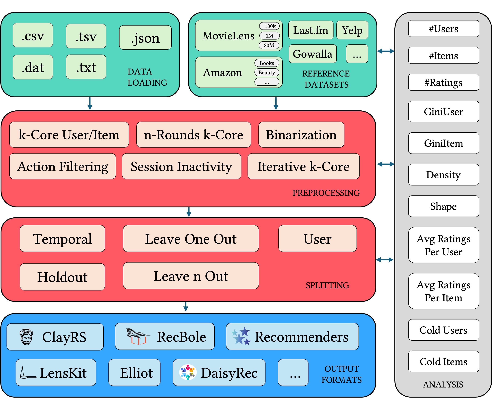

# 🧩 DataRec: A Python Library for Standardized and Reproducible Data Management in Recommender Systems"




This is the official GitHub repo for the paper *"DataRec: A Framework for Standardizing Recommendation Data Processing and Analysis"*.

## Table of Contents

- [What is DataRec](#what-is-datarec)
- [Installation guidelines](#installation-guidelines)
- [Datasets](#datasets)
- [Filtering Strategies](#filtering-strategies)
- [Splitting Strategies](#splitting-strategies)
- [Authors](#authors)

## What is DataRec
DataRec is a Python library that focuses on the data management phase of recommendation systems. It aims to promote standardization, interoperability, and best practices for processing and analyzing recommendation datasets.
### Features

- Dataset Management: Supports reading and writing various data formats and allows dynamic format specification.
- Reference Datasets: Includes commonly used recommendation datasets with traceable sources and versioning.
- Filtering Strategies: Implements popular filtering techniques.
- Splitting Strategies: Implements widely used data splitting strategies.
- Data Characteristics Analysis: Enables computing data characteristics that impact recommendation performance.
- Interoperability: Designed to be modular and compatible with existing recommendation frameworks by allowing dataset export in various formats.

## Installation guidelines
Please make sure to have the following installed on your system:

* Python `3.9.0` or later

you first need to clone this repository:
```sh
git clone https://github.com/sisinflab/DataRec.git
```
You may create the virtual environment with the requirements files we included in the repository, as follows:
```sh
$ python3.9 -m venv venv
$ source venv/bin/activate
$ pip install --upgrade pip
$ pip install -r requirements.txt
```

## Datasets
DataRec includes several commonly used recommendation datasets to facilitate reproducibility and standardization. These datasets have been carefully curated, with traceable sources and versioning information maintained whenever possible.
For each dataset, DataRec provides metadata such as the number of users, items, and interactions and data characteristics known to impact recommendation performance (e.g., sparsity and user/item distribution shifts).
The dataset collection in DataRec is continuously updated to include more recent and widely used datasets from the recommendation systems literature. The most recent and widely-used version is included when the original data source is unavailable to ensure backward compatibility.

The following datasets are currently included in DataRec:


| Dataset Name            | Source                                                                 |
|-------------------------|------------------------------------------------------------------------|
| Alibaba iFashion        | https://drive.google.com/drive/folders/1xFdx5xuNXHGsUVG2VIohFTXf9S7G5veq |
| Amazon Beauty           | https://amazon-reviews-2023.github.io                                  |
| Amazon Books            | https://amazon-reviews-2023.github.io/                                 |
| Amazon Clothing         | https://amazon-reviews-2023.github.io/                                 
| Amazon Sports and Outdoors | https://amazon-reviews-2023.github.io/                                 |
| Amazon Toys and Games  | https://amazon-reviews-2023.github.io/                                 |
| Amazon Video Games      | https://amazon-reviews-2023.github.io/                                 |
| Ciao | https://guoguibing.github.io/librec/datasets.html                      |
| Epinions                | https://snap.stanford.edu/data/soc-Epinions1.html                      |
| Gowalla                 | https://snap.stanford.edu/data/loc-gowalla.html                                          |
| LastFM                  | https://grouplens.org/datasets/hetrec-2011/                                                                |
| MovieLens               | https://grouplens.org/datasets/movielens/                                                |
| Tmall                       | https://tianchi.aliyun.com/dataset/53?t=1716541860503                                        |
| Yelp                        | https://www.yelp.com/dataset      |


## Next Updates
- ⏳ improving logger
- ⏳ improving signatures
- ⏳ documentation

## Authors

- Alberto Carlo Maria Mancino (alberto.mancino@poliba.it)
- Salvatore Bufi (salvatore.bufi@poliba.it)
- Angela Di Fazio (angela.difazio@poliba.it)
- Daniele Malitesta (daniele.malitesta@centralesupelec.fr)
- Antonio Ferrara (antonio.ferrara@poliba.it)
- Claudio Pomo (claudio.pomo@poliba.it)
- Tommaso Di Noia (tommaso.dinoia@poliba.it)
