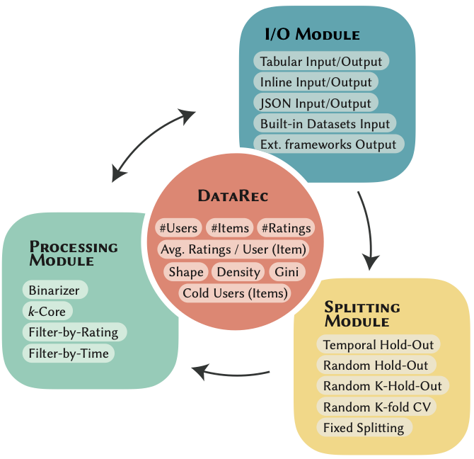

# 🧩 DataRec: A Python Library for Standardized and Reproducible Data Management in Recommender Systems

[](https://sisinflab.github.io/DataRec/)
[](LICENSE)
[](https://www.python.org/downloads/)

---


**DataRec** focuses on the **data management phase** of recommender systems, promoting **standardization**, **interoperability**, and **best practices** for data filtering, splitting, analysis, and export.

Official repository of the paper:  
📄 *DataRec: A Python Library for Standardized and Reproducible Data Management in Recommender Systems* (SIGIR 2025) [doi](https://dl.acm.org/doi/10.1145/3726302.3730320)

---

## 📑 Table of Contents
- [Features](#features-)
- [Installation](#installation)
- [Quickstart](#quickstart-)
- [Datasets](#datasets-)
- [Documentation](#documentation-)
- [Contributing](#contributing-)
- [Citation](#citation-)
- [Authors and Contributors](#authors-and-contributors-)
- [Related Projects](#related-projects-)
- [License](#license-)

---

## Features ✨
- **Dataset Management**: multi-format I/O with dynamic schema specification.  
- **Reference Datasets**: curated, versioned, and traceable datasets.  
- **Filtering Strategies**: widely used user/item interaction filters.  
- **Splitting Strategies**: temporal and random splits for reproducible evaluation.  
- **Data Characteristics**: compute dataset-level statistics (e.g., sparsity, popularity).  
- **Interoperability**: export datasets to external recommendation frameworks.  



---

## Installation

### From PyPI
```bash
pip install datarec-lib
```

### From source (recommended for development)
```bash
git clone https://github.com/sisinflab/DataRec.git
cd DataRec
python3.9 -m venv venv
source venv/bin/activate
pip install --upgrade pip
pip install -r requirements.txt
# editable mode + optional dependency groups (defined in pyproject.toml)
pip install -e '.[dev,docs]'
```


## Quickstart 🚀

```python
from datarec.datasets import AmazonOffice
from datarec.processing import FilterOutDuplicatedInteractions, UserItemIterativeKCore
from datarec.splitters import RandomHoldOut

# 1️⃣ Load a reference dataset
data = AmazonOffice(version='2014').prepare_and_load()

# 2️⃣ Apply preprocessing filters
data = FilterOutDuplicatedInteractions().run(data)
data = UserItemIterativeKCore(cores=5).run(data)

# 3️⃣ Split into train/validation/test
splitter = RandomHoldOut(test_ratio=0.2, val_ratio=0.1, seed=42)
splits = splitter.run(data)

train, val, test = splits['train'], splits['val'], splits['test']
```

### Pipeline paths
When using YAML pipelines, store only filenames in the steps and pass the base folders at runtime:

```python
from datarec.pipeline import Pipeline

pipeline = Pipeline.from_yaml("create_pipeline.yml")
pipeline.apply(input_folder="./data", output_folder="./outputs")
```

For file loaders use `filename` (instead of `path`) and for export steps use `filename`
(instead of `output_path`) in the YAML.

---

## Datasets 📊
The complete and up-to-date list of datasets (with metadata and statistics) is available in the documentation:

👉 **[Datasets Section](https://sisinflab.github.io/DataRec/datasets_nav/)**

---

## Documentation 📚
Full documentation available at: **https://sisinflab.github.io/DataRec/**  
Includes API reference, guides, tutorials, and dataset overview.

---

## Contributing 🤝

Contributions are welcome!  
To contribute:
1. Create a feature/fix branch.  
2. Add tests and documentation updates as needed.  
3. Run tests before pushing.  
4. Open a pull request describing your changes clearly.

> The project also receives updates from a **private development repository** maintained by SisInfLab.

---

## Citation 📖

If you use DataRec in your research, please cite our SIGIR 2025 paper:

```bibtex
@inproceedings{DBLP:conf/sigir/MancinoBF0MPN25,
  author       = {Alberto Carlo Maria Mancino and
                  Salvatore Bufi and
                  Angela Di Fazio and
                  Antonio Ferrara and
                  Daniele Malitesta and
                  Claudio Pomo and
                  Tommaso Di Noia},
  title        = {DataRec: {A} Python Library for Standardized and Reproducible Data
                  Management in Recommender Systems},
  booktitle    = {{SIGIR}},
  pages        = {3478--3487},
  publisher    = {{ACM}},
  year         = {2025}
}
```

---

## Authors and Contributors 👥

**Authors**  
- Alberto Carlo Maria Mancino (Politecnico di Bari)  
- Salvatore Bufi  
- Angela Di Fazio  
- Daniele Malitesta  
- Antonio Ferrara  
- Claudio Pomo  
- Tommaso Di Noia  

### Contributors

| | | | |
|:--:|:--:|:--:|:--:|
| [<br>**Alberto C. M. Mancino**](https://github.com/AlbertoMancino) | [<br>**Angela Di Fazio**](https://github.com/a-difazio) | [<br>**Salvatore Bufi**](https://github.com/salvatore-bufi) | [<br>**Giuseppe Fasano**](https://github.com/GiuseppeFasano) |
| [<br>**Gianluca Colonna**](https://github.com/GianLu210) | [<br>**Maria L. N. De Bonis**](https://github.com/MariaLuigiaN) | [<br>**Marco Valentini**](https://github.com/Marco-Valentini) |  |
---

## Related Projects 🧩

- **Ducho** — library for multimodal representation learning: https://github.com/sisinflab/Ducho  
- **D&D4Rec Tutorial (RecSys 2025)** — *Standard Practices for Data Processing and Multimodal Feature Extraction in Recommendation with DataRec and Ducho*:  
  https://sites.google.com/view/dd4rec-tutorial/home

---

## License 📜
Distributed under the **MIT License**.  
See [LICENSE](LICENSE).

---

<p align="center">
  <em>Maintained with ❤️ by <a href="https://github.com/sisinflab">SisInfLab</a></em> 
</p>
<p align="center">

</p>
