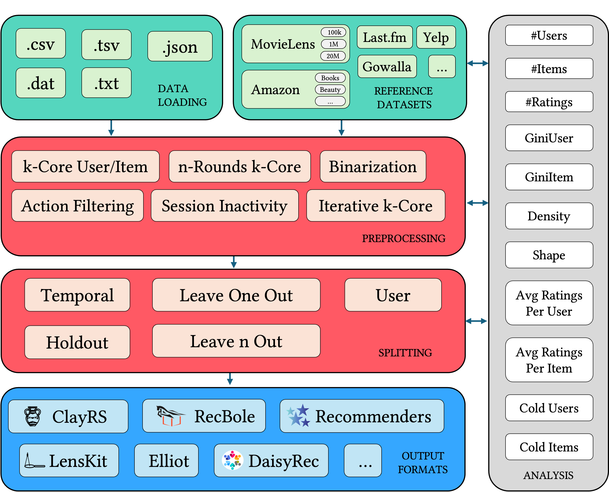

# 🧩 DataRec: A Framework for Standardizing Recommendation Data Processing and Analysis"




This is the official GitHub repo for the paper *"DataRec: A Framework for Standardizing Recommendation Data Processing and Analysis"*.

## Table of Contents

- [What is DataRec](#what-is-datarec)
- [Installation guidelines](#installation-guidelines)
- [Datasets](#datasets)
- [Filtering Strategies](#filtering-strategies)
- [Splitting Strategies](#splitting-strategies)
- [Authors](#authors)

## What is DataRec
DataRec is a Python framework that focuses on the data management phase of recommendation systems. It aims to promote standardization, interoperability, and best practices for processing and analyzing recommendation datasets.
### Features

- Dataset Management: Supports reading and writing various data formats (data, csv, tsv, txt, JSON) and allows dynamic format specification.
- Reference Datasets: Includes commonly used recommendation datasets with traceable sources and versioning.
- Filtering Strategies: Implements popular filtering techniques.
- Splitting Strategies: Implements widely used data splitting strategies.
- Data Characteristics Analysis: Enables computing data characteristics that impact recommendation performance.
- Interoperability: Designed to be modular and compatible with existing recommendation frameworks by allowing dataset export in various formats.
## Installation guidelines
Please make sure to have the following installed on your system:

* Python `3.9.0` or later

you first need to clone this repository:
```sh
git clone https://link_finale
```
You may create the virtual environment with the requirements files we included in the repository, as follows:
```sh
$ python3.9 -m venv venv
$ source venv/bin/activate
$ pip install --upgrade pip
$ pip install -r requirements.txt
```

## Datasets
DataRec includes several commonly used recommendation datasets to facilitate reproducibility and standardization. These datasets have been carefully curated, with traceable sources and versioning information maintained whenever possible.
For each dataset, DataRec provides metadata such as the number of users, items, and interactions and data characteristics known to impact recommendation performance (e.g., sparsity and user/item distribution shifts).
The dataset collection in DataRec is continuously updated to include more recent and widely used datasets from the recommendation systems literature. The most recent and widely-used version is included when the original data source is unavailable to ensure backward compatibility.

The following datasets are currently included in DataRec:


| Dataset Name               | Source                                                                                         |
|----------------------------|------------------------------------------------------------------------------------------------|
| Yelp                       | https://www.yelp.com/dataset                                                                    |
| Amazon Book                | https://datarepo.eng.ucsd.edu/mcauley_group/data/amazon_2023/benchmark/0core/rating_only/Books.csv.gz |
| Toys and Games             | https://datarepo.eng.ucsd.edu/mcauley_group/data/amazon_2023/benchmark/0core/rating_only/Toys_and_Games.csv.gz |
| Sports and Outdoors        | https://datarepo.eng.ucsd.edu/mcauley_group/data/amazon_2023/benchmark/0core/rating_only/Sports_and_Outdoors.csv.gz |
| Video Games                | https://datarepo.eng.ucsd.edu/mcauley_group/data/amazon_2023/benchmark/0core/rating_only/Video_Games.csv.gz |
| Clothing, Shoes, and Jewelry | https://datarepo.eng.ucsd.edu/mcauley_group/data/amazon_2023/benchmark/0core/rating_only/Clothing_Shoes_and_Jewelry.csv.gz |
| MovieLens 1M               | https://grouplens.org/datasets/movielens/1m/                                                    |
| LastFM                     | https://grouplens.org/datasets/hetrec-2011/                                                                       |
| Amazon Beauty              | https://amazon-reviews-2023.github.io/data_processing/0core.html                                |
| Tmall                      | https://tianchi.aliyun.com/dataset/53?t=1716541860503                                          |
| Alibaba Fashion            | https://drive.google.com/drive/folders/1xFdx5xuNXHGsUVG2VIohFTXf9S7G5veq                        |
| MovieLens 20M              | https://grouplens.org/datasets/movielens/20m/                                                   |
| Gowalla                    | https://snap.stanford.edu/data/loc-gowalla.html                                                 |
| Epinions                   | https://snap.stanford.edu/data/soc-Epinions1.html                                               |


## Filtering Strategies
DataRec implements various filtering techniques commonly applied to recommendation datasets:

- k-Core Filtering: Retains only users and items with at least k interactions. Variants include k-Core User (filtering out users with less than k interactions), k-Core Item (filtering out items with less than k interactions), and Iterative k-Core (iteratively removing users and items until convergence).
- Binarization: A common preprocessing step for implicit feedback data, where ratings over threshold are set to 1, while the remaining set to 0.
- Session Filtering: Techniques for filtering sessions/baskets of items, such as retaining only sessions of a certain length or removing sessions with long inactivity periods.
- Action Filtering: Filtering out specific types of user-item interactions (e.g., removing negative interactions like dislikes or low ratings).
- n-Rounds k-Core: An extension of k-core filtering that iterates the process for n rounds, allowing more aggressive pruning of the dataset.

These filtering strategies can be used independently or combined to preprocess the data according to the requirements of the recommendation task and algorithm.


## Splitting Strategies
DataRec provides implementations of wide data-splitting strategies for recommendation systems:

- Holdout Split: Allocates a percentage of the dataset for testing; the remainder is partitioned into training and validation sets.
- Leave N Out: Extracts randomly N transactions per user for testing, N (can also be set as a different value) transaction validation, and the remaining for training. Supports the variant Leave One Out where N is set to 1 for test and validation sets.
- Leave N Last: Extracts the final N transaction per user for testing, the next N transactions for validation, and the remaining for training. Supports variants like Leave One Last Item, where only the last and the second-to-last are retained for testing and validation, respectively.
- Temporal Split: Segments historical interactions by timestamp, allocating a percentage of each user's most recent interactions for testing (Temporal User) or using a global time cutoff with all interactions after that point for testing (Temporal Global).
- User Split: Adaptation of the methods above but stratified for each user.

## Articles
The following table contains a list of articles included in our literature review for DataRec:

| Title                                                                                                     | Year | Conference                                          |
|-----------------------------------------------------------------------------------------------------------|------|-----------------------------------------------------|
| KGTORe: Tailored Recommendations through Knowledge-aware GNN Models                                       | 2023 | RecSys                                              |
| Revisiting Graph based Collaborative Filtering: A Linear Residual Graph Convolutional Network Approach    | 2020 | AAAI                                                |
| Graph-based regularization on embedding layers for recommendation                                         | 2020 | TOIS                                                |
| Temporal Graph Neural Networks for Social Recommendation                                                  | 2020 | ICBD                                                |
| S3-Rec: Self-Supervised Learning for Sequential Recommendation with Mutual Information Maximization       | 2020 | CIKM                                                |
| Dynamic graph neural networks for sequential recommendation                                               | 2022 | TKDE                                                |
| Graph Convolution Machine for Context-aware Recommender System                                            | 2022 | FCS                                                 |
| Sequential Recommendation with Graph Neural Networks                                                      | 2021 | SIGIR                                               |
| Dual Graph enhanced Embedding Neural Network for CTR Prediction                                           | 2021 | SIGKDD                                              |
| Knowledge-aware Coupled Graph Neural Network for Social Recommendation.                                   | 2021 | AAAI                                                |
| Social Recommendation with Implicit Social Influence                                                      | 2021 | SIGIR                                               |
| Self-Supervised Multi-Channel Hypergraph Convolutional Network for Social Recommendation                  | 2021 | WWW                                                 |
| Explore User Neighborhood for Real-time E-commerce Recommendation                                         | 2021 | ICDE                                                |
| LightGCN: Simplifying and Powering Graph Convolution Network for Recommendation                           | 2020 | SIGIR                                               |
| Knowledge Graph Self-Supervised Rationalization for Recommendation                                        | 2023 | KDD                                                 |
| Knowledge Graph Contrastive Learning for Recommendation                                                   | 2022 | SIGIR                                               |
| Multi-Modal Self-Supervised Learning for Recommendation                                                   | 2023 | WWW                                                 |
| Heterogeneous Graph Contrastive Learning for Recommendation                                               | 2023 | WSDM                                                |
| Automated Self-Supervised Learning for Recommendation                                                     | 2023 | WWW                                                 |
| Self-Supervised Graph Learning for Recommendation                                                         | 2021 | SIGIR                                               |
| Are Graph Augmen- tations Necessary?: Simple Graph Contrastive Learning for Recommendation                | 2022 | SIGIR                                               |
| XSimGCL: To- wards extremely simple graph contrastive learning for recommendation.                        | 2022 | Arxiv                                               |
| LightGCL: Simple Yet Effective Graph Contrastive Learning for Recommendation                              | 2023 | ICLR                                                |
| Learning to Denoise Unreliable Interactions for Graph Collaborative Filtering                             | 2022 | SIGIR                                               |
| Disentangled Contrastive Collaborative Filtering                                                          | 2023 | SIGIR                                               |
| Graph Contrastive Learning with Adaptive Augmentation for Recommendation                                  | 2022 | PKDD                                                |
| Adaptive Graph Contrastive Learning for Recommendation                                                    | 2023 | KDD                                                 |
| Graph-less Collaborative Filtering                                                                        | 2023 | WWW                                                 |
| A review-aware graph contrastive learning framework for recommendation                                    | 2022 | SIGIR                                               |
| Multi- level Contrastive Learning Framework for Sequential Recommendation                                 | 2022 | CIKM                                                |
| Hypergraph Contrastive Collaborative Filtering                                                            | 2022 | SIGIR                                               |
| A Multi-Strategy-Based Pre-Training Method for Cold-Start Recommendation                                  | 2023 | TOIS                                                |
| Multi-level Cross-view Contrastive Learning for Knowledge-aware Recommender System                        | 2022 | SIGIR                                               |
| Knowledge-Adaptive Contrastive Learning for Recommendation                                                | 2023 | WSDM                                                |
| Self-supervised Graph Neural Networks for Multi-behavior Recommendation                                   | 2022 | IJCAI                                               |
| Multi-view multi-behavior contrastive learning in recommendation                                          | 2022 | DASFAA                                              |
| Socially-aware self-supervised tri-training for recommendation                                            | 2022 | KDD                                                 |
| Self-supervised graph co-training for session-based recommendation                                        | 2022 | CIKM                                                |
| Double-scale self-supervised hypergraph learning for group recommendation                                 | 2021 | CIKM                                                |
| Feature-Level Deeper Self-Attention Network With Contrastive Learning for Sequential Recommendation       | 2023 | IEEE Transactions on Knowledge and Data Engineering |
| Ensemble Modeling with Contrastive Knowledge Distillation for Sequential Recommendation                   | 2023 | SIGIR                                               |
| Session-aware recommendation: A surprising quest for the state-of-the-art                                 | 2021 | Information Sciences                                |
| Utilizing Human Memory Processes to Model Genre Preferences for Personalized Music Recommendations        | 2021 | Information Sciences                                |
| Contextual and Sequential User Embeddings for Large-Scale Music Recommendation                            | 2020 | RecSys                                              |
| Incorporating time-interval sequences in linear TV for next-item prediction                               | 2022 | Expert Systems With Applications                    |
| Assessment that matters: balancing reliability and learner-centered pedagogy in MOOC assessment           | 2020 | LAK                                                 |
| Session‑aware news recommendations using random walks on time‑evolving heterogeneous information networks | 2020 | UMUAI                                               |
| Towards long-term fairness in recommendation                                                              | 2021 | WSDM                                                |
| Deep reinforcement learning framework for category-based item recommendation                              | 2021 | IEEE Transactions on Cybernetics                    |
| Diff4Rec: Sequential Recommendation with Curriculum-scheduled Diffusion Augmentation                      | 2023 | MM: International Multimedia Conference             |
| Diffusion Recommender Model                                                                               | 2023 | SIGIR                                               |
| FISSA: Fusing item similarity models with self-attention networks for sequential recommendation           | 2020 | RecSys                                              |
| Personalized prompt learning for explainable recommendation.                                              | 2023 | SIGIR                                               |
| Rexplug: Explainable recommendation using plug-and-play language model.                                   | 2021 | SIGIR                                               |
| Recommender systems with generative retrieval                                                             | 2024 | NIPS                                                |
| Contrastvae: Contrastive variational autoencoder for sequential recommendation                            | 2022 | CIKM                                                |

## Next Updates
- ⏳ improving logger
- ⏳ improving signatures
- ⏳ documentation

## Authors

- Alberto Carlo Maria Mancino (alberto.mancino@poliba.it)
- Salvatore Bufi (salvatore.bufi@poliba.it)
- Angela Di Fazio (angela.difazio@poliba.it)
- Daniele Malitesta (daniele.malitesta@centralesupelec.fr)
- Antonio Ferrara (antonio.ferrara@poliba.it)
- Claudio Pomo (claudio.pomo@poliba.it)
- Tommaso Di Noia (tommaso.dinoia@poliba.it)
