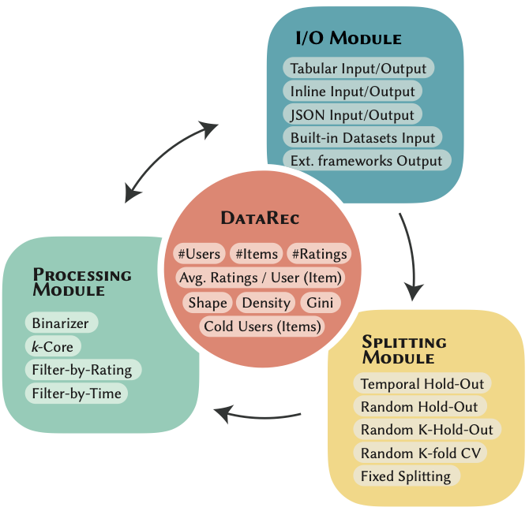

# Welcome to the Documentation of DataRec: A Python Library for Standardized and Reproducible Data Management in Recommender Systems

This is the official Documentation Website for the paper *"DataRec: A Python Library for Standardized and Reproducible Data Management in Recommender Systems"*, accepted for publication at the "The 48th International ACM SIGIR Conference on Research and Development in Information Retrieval", SIGIR 2025.

## Table of Contents

- [What is DataRec](#what-is-datarec)
- [Filtering Strategies](#filtering-strategies)
- [Splitting Strategies](#splitting-strategies)
- [Authors](#authors)

## What is DataRec
DataRec is a Python library that focuses on the data management phase of recommendation systems. It aims to promote standardization, interoperability, and best practices for processing and analyzing recommendation datasets.

### Features
- Dataset Management: Supports reading and writing various data formats and allows dynamic format specification.
- Reference Datasets: Include commonly used recommendation datasets with traceable sources and versioning.
- Filtering Strategies: Implements popular filtering techniques.
- Splitting Strategies: Implements widely used data splitting strategies.
- Data Characteristics Analysis: Enables computing data characteristics that impact recommendation performance.
- Interoperability: Designed to be modular and compatible with existing recommendation frameworks by allowing dataset export in various formats.

## Authors

- Alberto Carlo Maria Mancino (alberto.mancino@poliba.it)
- Salvatore Bufi (salvatore.bufi@poliba.it)
- Angela Di Fazio (angela.difazio@poliba.it)
- Daniele Malitesta (daniele.malitesta@centralesupelec.fr)
- Antonio Ferrara (antonio.ferrara@poliba.it)
- Claudio Pomo (claudio.pomo@poliba.it)
- Tommaso Di Noia (tommaso.dinoia@poliba.it)

